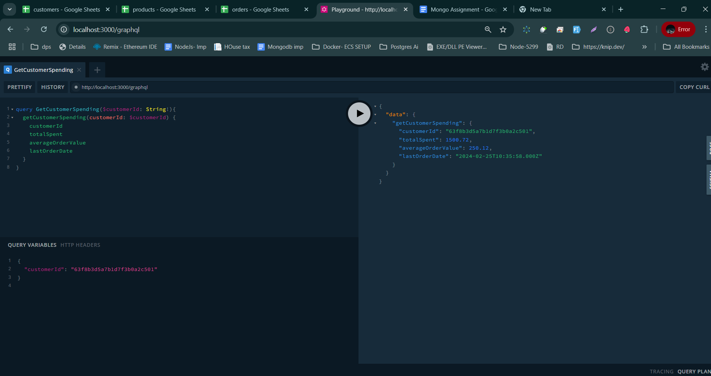
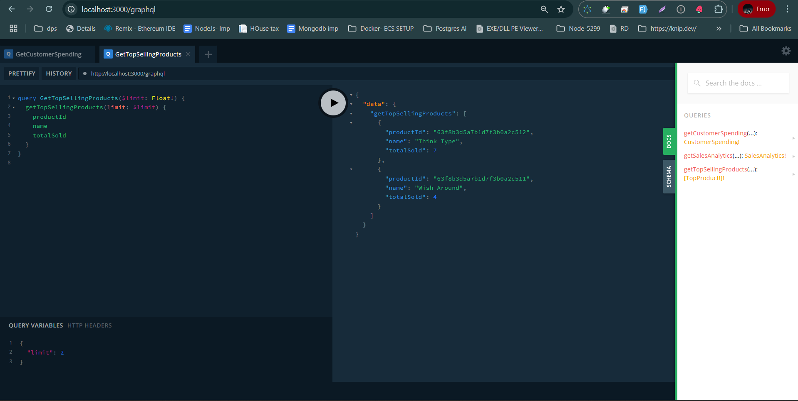
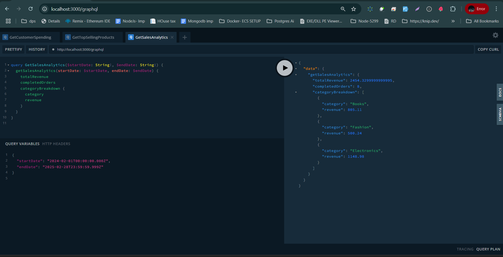

# **📊 Sales & Revenue Analytics API**
A **GraphQL API** for analyzing customer spending, product sales trends, and revenue insights for an e-commerce platform.

<p align="center">
  <a href="http://nestjs.com/" target="blank"></a>
</p>


## **🚀 Features**
- ✅ **Get Customer Spending** insights: total spent, average order value, and last order date.
- ✅ **Get Top-Selling Products** based on total quantity sold.
- ✅ **Get Sales Analytics**: revenue breakdown, total revenue, and completed orders count.
- ✅ Uses **MongoDB Aggregations** for optimized queries.
- ✅ Built with **NestJS**, **GraphQL**, and **MongoDB**.

---

## **🛠 Installation & Setup**
### **1️⃣ Clone the Repository**
```bash
git clone https://github.com/your-username/sales-analytics-api.git
cd sales-analytics-api
```

### **2️⃣ Install Dependencies**
```bash
npm install
```

### **3️⃣ Set Up MongoDB**
Ensure you have **MongoDB running locally** or provide a **MongoDB Atlas connection URL** in your environment variables.

Create a `.env` file in the root directory and configure:
```
MONGO_URI=mongodb://localhost:27017/sales-analytics
PORT=3000
```

### **4️⃣ Import Dataset into MongoDB**
- Download the dataset: [Seed Data](https://drive.google.com/file/d/1g47E54fmcYFrjJVJSeok5O2VmLxiJCXk/view?usp=sharing).
- Use **MongoDB Compass** or **Mongo Import CLI** to load the data:
```bash
mongoimport --uri="mongodb://localhost:27017/sales-analytics" --collection=customers --file=customers.json --jsonArray
mongoimport --uri="mongodb://localhost:27017/sales-analytics" --collection=products --file=products.json --jsonArray
mongoimport --uri="mongodb://localhost:27017/sales-analytics" --collection=orders --file=orders.json --jsonArray
```

### **5️⃣ Start the Application**
```bash
# Development mode
npm run start:dev
```
The API will be available at: **http://localhost:3000/graphql**

---

## **📡 GraphQL API Endpoints**
### **1️⃣ Get Customer Spending**
#### **Query**
```graphql
query GetCustomerSpending($customerId: ID!) {
  getCustomerSpending(customerId: $customerId) {
    customerId
    totalSpent
    averageOrderValue
    lastOrderDate
  }
}
```
#### **Example Response**
```json
{
  "customerId": "63f8b3d5a7b1d7f3b0a2c5e1",
  "totalSpent": 1500.75,
  "averageOrderValue": 250.12,
  "lastOrderDate": "2024-02-18T10:30:00Z"
}
```

---

### **2️⃣ Get Top-Selling Products**
#### **Query**
```graphql
query GetTopSellingProducts($limit: Int!) {
  getTopSellingProducts(limit: $limit) {
    productId
    name
    totalSold
  }
}
```
#### **Example Response**
```json
[
  { "productId": "63f8b3d5a7b1d7f3b0a2c5e5", "name": "Wireless Headphones", "totalSold": 300 },
  { "productId": "63f8b3d5a7b1d7f3b0a2c5e6", "name": "Smartwatch", "totalSold": 250 }
]
```

---

### **3️⃣ Get Sales Analytics**
#### **Query**
```graphql
query GetSalesAnalytics($startDate: String!, $endDate: String!) {
  getSalesAnalytics(startDate: $startDate, endDate: $endDate) {
    totalRevenue
    completedOrders
    categoryBreakdown {
      category
      revenue
    }
  }
}
```
#### **Example Response**
```json
{
  "totalRevenue": 125000.50,
  "completedOrders": 500,
  "categoryBreakdown": [
    { "category": "Electronics", "revenue": 70000.25 },
    { "category": "Fashion", "revenue": 35000.00 }
  ]
}
```

---

## 📂 **File Structure**
```
📦 sales-analytics-api
 ┣ 📂 src
 ┃ ┣ 📂 modules
 ┃ ┃ ┣ 📂 customer
 ┃ ┃ ┃ ┣ 📂 dto
 ┃ ┃ ┃ ┃ ┣ 📜 customer-spending.dto.ts
 ┃ ┃ ┃ ┣ 📂 interfaces
 ┃ ┃ ┃ ┃ ┣ 📜 customer.interface.ts
 ┃ ┃ ┃ ┣ 📂 models
 ┃ ┃ ┃ ┃ ┣ 📜 customer.model.ts
 ┃ ┃ ┃ ┣ 📂 resolvers
 ┃ ┃ ┃ ┃ ┣ 📜 customer.resolver.ts
 ┃ ┃ ┃ ┣ 📂 services
 ┃ ┃ ┃ ┃ ┣ 📜 customer.service.ts
 ┃ ┃ ┃ ┣ 📜 customer.module.ts
 ┃ ┃ ┣ 📂 order
 ┃ ┃ ┣ 📂 product
 ┃ ┣ 📜 app.module.ts
 ┣ 📜 .env
 ┣ 📜 package.json
 ┣ 📜 README.md
 ┣ 📂 uploads
 ┃ ┣ 📜 output1.png
 ┃ ┣ 📜 output2.png
 ┃ ┣ 📜 output3.png
```

---

## **🛠 Testing**
Run the following tests:
```bash
# Unit tests
npm run test

# End-to-end (E2E) tests
npm run test:e2e

# Test coverage
npm run test:cov
```

---

## **📸 Output**
### 1️⃣ **Project File Structure & Running App**


### 2️⃣ **GraphQL Playground Query Execution**


### 3️⃣ **API Response in JSON Format**


---
